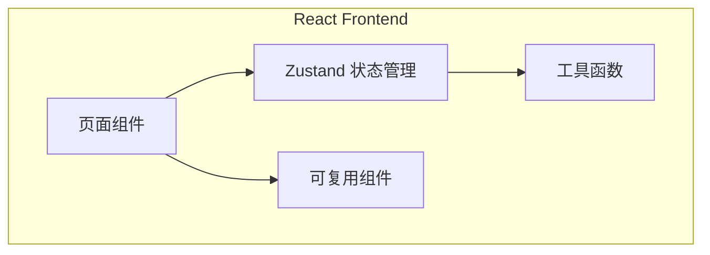

## 1. Architecture Design
纯前端应用，使用 React 状态管理模拟 AI 功能。



## 2. Technology Description
- Frontend: React@18 + TypeScript + tailwindcss@3 + vite
- State Management: Zustand
- Routing: React Router DOM
- Icons: Lucide React
- Initialization Tool: vite-init

## 3. Route Definitions
| Route | Purpose |
|-------|---------|
| / | JD 上传和解析页面 |
| /questions/:sessionId | 题目答题页面 |
| /analysis/:sessionId | 能力分析页面 |
| /highlights/:sessionId | 简历亮点展示页面 |

## 4. Data Model

### 4.1 Data Type Definitions

```typescript
// 会话状态
interface Session {
  id: string;
  jdText: string;
  parsedJd?: ParsedJd;
  questions: Question[];
  answers: Record&lt;string, string&gt;;
  analysis?: AnalysisResult;
  highlights?: ResumeHighlights;
  status: 'idle' | 'parsing' | 'generating' | 'answering' | 'analyzing' | 'complete';
}

// 解析后的JD
interface ParsedJd {
  title: string;
  company: string;
  requirements: string[];
  responsibilities: string[];
  skills: string[];
  description: string;
}

// 题目类型
interface Question {
  id: string;
  text: string;
  options: Option[];
  category: string;
  difficulty: 'easy' | 'medium' | 'hard';
}

// 选项类型
interface Option {
  id: string;
  text: string;
  score: number; // 用于评分
}

// 能力维度得分
interface DimensionScore {
  name: string;
  score: number;
  maxScore: number;
  description: string;
}

// 分析结果
interface AnalysisResult {
  overallScore: number;
  dimensions: DimensionScore[];
  strengths: string[];
  improvements: string[];
  detailedFeedback: string;
}

// 简历亮点
interface ResumeHighlight {
  category: 'skills' | 'experience' | 'soft-skills' | 'achievements';
  title: string;
  description: string;
  keywords: string[];
}

interface ResumeHighlights {
  highlights: ResumeHighlight[];
  summary: string;
}
```

### 4.2 Zustand Store Structure

```typescript
interface AppState {
  session: Session | null;
  // Actions
  createSession: (jdText: string) =&gt; Session;
  parseJd: (sessionId: string) =&gt; Promise&lt;void&gt;;
  generateQuestions: (sessionId: string) =&gt; Promise&lt;void&gt;;
  submitAnswer: (sessionId: string, questionId: string, optionId: string) =&gt; void;
  analyzeResults: (sessionId: string) =&gt; Promise&lt;void&gt;;
  generateHighlights: (sessionId: string) =&gt; Promise&lt;void&gt;;
  resetSession: () =&gt; void;
}
```

## 5. File Structure
```
src/
├── components/
│   ├── JdInput.tsx
│   ├── QuestionCard.tsx
│   ├── ProgressIndicator.tsx
│   ├── AnalysisChart.tsx
│   └── HighlightCard.tsx
├── pages/
│   ├── Home.tsx
│   ├── QuestionsPage.tsx
│   ├── AnalysisPage.tsx
│   └── HighlightsPage.tsx
├── hooks/
│   └── useSession.ts
├── store/
│   └── index.ts (Zustand store)
├── utils/
│   ├── jdParser.ts
│   ├── questionGenerator.ts
│   ├── analyzer.ts
│   └── highlightGenerator.ts
├── types/
│   └── index.ts
└── App.tsx
```

## 6. Implementation Notes

### 6.1 Mock AI Functions
- `jdParser.ts`: 根据JD文本模拟解析关键信息
- `questionGenerator.ts`: 根据解析的JD生成30+道选择题
- `analyzer.ts`: 根据答题情况模拟能力分析
- `highlightGenerator.ts`: 根据分析结果模拟简历亮点提取

### 6.2 Key Features
- 使用 localStorage 保存会话状态
- 响应式设计
- 流畅的动画过渡
- 清晰的进度反馈

