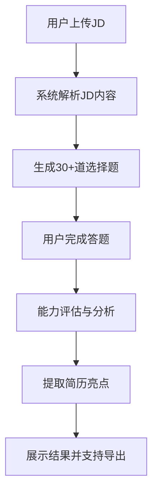

## 1. Product Overview
为用户提供JD自定义上传、AI智能生成题目、能力评测、简历亮点提取的一体化平台
- 解决传统简历辅导中用户无法真正理解和证明自己能力的痛点，通过基于JD的智能题目生成和详细分析，帮助用户挖掘和展示自身优势
- 目标用户：在校大学生、求职者

## 2. Core Features

### 2.1 User Roles
| Role | Registration Method | Core Permissions |
|------|---------------------|------------------|
| Normal User | No registration | Upload JD, complete questions, view results |

### 2.2 Feature Module
1. **JD 上传页面**: JD 文本输入、上传、解析展示
2. **题目生成页面**: 显示基于JD生成的30+选择题，进度追踪
3. **能力分析页面**: 详细的能力评估结果展示
4. **简历亮点页面**: 简历亮点提取和展示

### 2.3 Page Details
| Page Name | Module Name | Feature description |
|-----------|-------------|---------------------|
| JD上传页面 | JD输入区域 | 文本区域输入或粘贴招聘JD，支持大文本 |
| JD上传页面 | JD解析展示 | 解析JD的关键内容，包括岗位要求、所需技能、职责等 |
| JD上传页面 | 题目生成触发 | 确认后开始生成题目，显示生成进度 |
| 题目生成页面 | 题目列表展示 | 30+选择题，分页或滚动展示 |
| 题目生成页面 | 答题功能 | 每个题目4个选项，支持保存答题进度 |
| 题目生成页面 | 进度指示器 | 显示当前答题进度，已完成/总题目数 |
| 能力分析页面 | 能力维度展示 | 按不同维度（专业技能、软技能等）展示得分 |
| 能力分析页面 | 详细分析报告 | 每个能力的详细说明和用户表现 |
| 简历亮点页面 | 亮点分类展示 | 按专业技能、项目经验、软技能等分类展示简历亮点 |
| 简历亮点页面 | 导出功能 | 支持复制或导出亮点内容 |

## 3. Core Process
用户上传JD → 系统解析JD → 生成30+选择题 → 用户完成答题 → 系统进行能力分析 → 提取并展示简历亮点

## 4. User Interface Design
### 4.1 Design Style
- Primary color: Deep blue (#1e40af) with accents of teal (#0d9488)
- Secondary colors: Slate gray for backgrounds, orange for highlights
- Button style: Rounded rectangles with subtle shadows, hover elevation
- Font family: Modern sans-serif (Inter) for readability, with larger headings
- Layout style: Card-based with clean sections, generous whitespace
- Icon style: Lucide React icons, consistent stroke width 2px

### 4.2 Page Design Overview
| Page Name | Module Name | UI Elements |
|-----------|-------------|-------------|
| JD上传页面 | 主容器 | 渐变背景，居中卡片布局，大标题 |
| JD上传页面 | 输入区域 | 大文本框，带占位提示，清晰提交按钮 |
| 题目生成页面 | 题目卡片 | 每题独立卡片，选项有悬停效果，进度条 |
| 能力分析页面 | 分析展示 | 数据可视化图表，详细卡片，清晰的进度条 |
| 简历亮点页面 | 亮点展示 | 分组卡片，高亮效果，复制功能 |

### 4.3 Responsiveness
Desktop-first design, fully responsive for mobile and tablet. Optimize touch targets and layout spacing for small screens.

